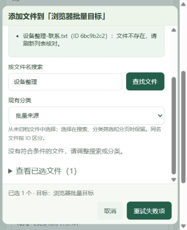
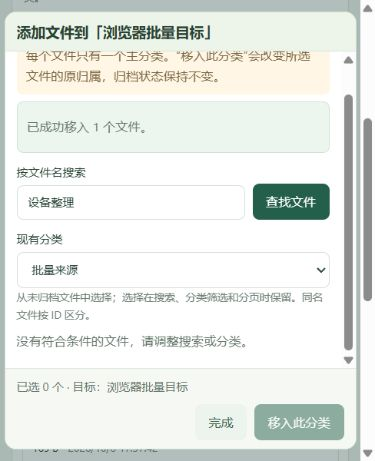

# 扁平分类批量整理

## 实现范围

创建分类成功后，弹窗显示“添加文件”，直接进入新分类的文件选择弹窗。每个分类页（包括未分类）也有这个入口。选择弹窗支持名称搜索、原分类过滤、分页和多选，显示当前归属、文件 ID 和已选数量；切换搜索、过滤、分页不丢失选择，可展开已选清单移除项。同名文件始终按完整 ID 提交。已在目标分类的文件显示状态并禁止再次勾选。

文件列表增加文件勾选、“选择本页”、“移动分类”和“清空选择”。可跨页勾选，最多100个；切换主列表搜索/分类/归档范围会清除选择，避免移动看不到的旧范围资料。移动弹窗明确要求选择目标（含未分类），不会预选一个分类后直接提交。归档区也可整理，但移动不会恢复归档文件。

两种入口都明确说明：每个文件只有一个主分类，移入会替换原归属。成功后读取最新分类数量和文件列表。部分失败显示具体文件名、ID、原因，只保留失败选择；“重试失败项”只提交这些选择。若继续勾选其他文件，按钮改回“移入此分类”。请求/响应中断时保留选择并说明结果未确认；重复赋予同一分类安全，不会增加数量或片段。不存在的文件应刷新核对或从选择中移除。

弹窗中部独立滚动，底部数量、目标、提交和取消固定可见；窄屏仍可选取和提交。保持扁平分类，没有增加目录树、数据库表、向量重建流程或部署服务。

## API 与一致性

新增 `PATCH /api/v1/documents/batch/category`：

```json
{"categoryId":"目标分类UUID或null","documentIds":["文件UUID1","文件UUID2"]}
```

`categoryId` 实际值为 UUID 字符串或 JSON `null`，`null` 表示未分类。最多100个 ID、至少1个；重复 ID 合并后逐个返回结果。示意响应：

```json
{
  "categoryId":"目标分类UUID",
  "succeededCount":1,
  "failedCount":1,
  "items":[
    {"documentId":"文件UUID1","name":"设备整理-操作.txt","success":true,"changed":true},
    {"documentId":"文件UUID2","name":null,"success":false,"error":{"code":"DOCUMENT_NOT_FOUND","message":"文件不存在，请刷新列表核对。","retryable":false}}
  ]
}
```

这是接口格式示例，真实请求响应在证据 JSON 中。HTTP200只代表批次得到确认，页面必须检查各项 `success`，不能把部分失败提示成整批成功。

在 SQLite `BEGIN IMMEDIATE` 单事务中先验证目标、读取文件，更新存在的记录；缺失 ID 返回逐文件失败。成功重复提交 `changed=false`。目标不存在返回404、格式/数量错误返回422，均不改任何文件。数据库或提交失败返回可重试503，不能给出已确认的逐项成功；真实写入故障实验已验证整批回滚。没有修改归档状态、原文件、正文、索引任务或向量。分类过滤继续读取文件当前归属，不使用索引时缓存的旧分类。

`GET /api/v1/documents` 增加可选 `name_query`（最多200字），使用现有 Unicode 正规化和字面子串匹配；与 `category_id`、`archived`、`limit/offset` 同时生效。它只查文件名，正文关键词不会冒充文件选择弹窗的名称命中。弹窗每页20条，移走最后一页内容后自动回到仍存在的页。

## 实际执行与证据

证据目录：`docs/evidence/batch-organization`。以下Agent内置浏览器/自动化结果保留原始实测记录。用户现已另行确认普通Chrome批量分类通过，来源和范围单列，不混记为Agent执行。

| 类型 | 实际结果 | 证据 |
| --- | --- | --- |
| TypeScript/Vite | 最终 npm run build 退出0；最终构建页面30模块 | frontend-build-final.log |
| 源码挂载的隔离 Docker 真实 HTTP | 既有分类/归档4项通过，1.081秒；批量6项通过，2.048秒，退出0 | results.json、batch.json、batch-summary.json |
| 批量接口6项内容 | 同名ID区分、有效/缺失混合返回、重复ID合并、失败项重试/重复移动不增数；无效目标/空批次/101个/坏ID拒绝；独立读取归属/数量、关键词/语义新分类过滤；名称分页/正文不冒充名称/字面百分号；归档文件移至未分类仍归档；4个原文件下载SHA/字节一致 | batch.json |
| Agent内置浏览器1280×720 | 创建“浏览器批量目标”→添加文件；跨页选择保留；名称+原分类过滤；两份同名文件统一移动；刷新后来源4→2、目标0→2，ID仍不同 | browser-records.json、desktop-selected.png、desktop-success.png |
| Agent内置浏览器390×480 | 主列表选本页两文件→移动分类→选目标→Enter提交成功；分类页添加文件、名称/原分类筛选、多选TXT可操作，无横向溢出 | narrow-list-move.png、narrow-picker-selected.png |
| 真实部分失败与UI重试 | 在隔离库暂时隐藏已勾选样本的数据库记录，保留字节并备份单文件全部正文/索引/向量；真实批次1成功1失败，页面指明“设备整理-联系.txt/6bc9b2c2”、剩余1项；恢复记录后Enter重试，仅剩余文件成功 | fault-hide.log、fault-restore.log、narrow-partial-failure.png、narrow-retry-success.png、browser-records.json |
| 浏览器刷新与两种搜索 | 完成后来源0、批量目标2、浏览器目标2；TXT新分类下正文命中，语义返回对应来源（0.541/0.536）；原分类两种搜索为空；刷新保留目标2文件及分类ID | browser-records.json |
| 浏览器后真实HTTP与SQL故障 | 3项通过，0.103秒：三个分类的列表/关键词/语义及数量与浏览器操作一致；测试触发器让SQL更新真正失败，503后原归属全部保留，移除触发器后重试成功；恢复文件及其余样本仍ready/片段数一致、4个下载SHA保持 | post-browser.json、post-browser-http.log、container-http.log |
| 低高度布局 | 390×300底部按钮top240.5/bottom278<300。首次滚动探测未移动，未算通过；等待20条文件实际加载后再次鼠标滚动，内容scrollHeight1589、scrollTop0→300，底部287<300；宽度scrollWidth=clientWidth=375（390视口另有15px纵向滚动条） | browser-records.json、demo-390x300-picker-scrolled.png |
| 最终Docker镜像 | build退出0、90.551秒；up -d --no-build --force-recreate --wait退出0、12.336秒；另一独立空卷无业务源码/前端绑定，既有4项0.470秒、批量6项2.250秒均通过 | build-summary.json、up-summary.json、final-image/results.json、final-image/batch-final-image.json、final-image/execution-summary.json |
| 演示数据保留与新入口 | 更新前后26文件、9分类完整元数据及26份下载SHA完全一致；在8000内置浏览器只打开/取消新弹窗，看到最终index-BdynQb7T.js和20条真实文件、底部按钮可达，没有添加演示测试资料或修改归属 | demo-before.json、demo-after.json、demo-narrow-picker.png、demo-page.png |
| 普通Chrome用户人工 | **用户手动通过**：添加文件入口清晰、多选移动、数量更新、刷新保留、关键词和语义分类过滤正常。窗口尺寸未说明；当时不据此推断改名/低高度/390px及部分失败重试；后续用户已汇总确认完成，专项明细未提供 | user-validation.md |

命令在项目根目录执行，日志记录实测，不用预期代替通过：

```sh
python scripts/run_acceptance_docker.py --app-dir app --frontend-dir frontend/dist --port 18086 --keep-running
docker exec <隔离容器> python scripts/verify_batch_organization.py --report /tmp/check-reports/batch.json
docker exec <隔离容器> python scripts/batch_ui_fault.py hide --document-id <样本ID>
# 浏览器提交：1成功1失败
docker exec <隔离容器> python scripts/batch_ui_fault.py restore --document-id <同一ID>
# 浏览器只重试失败项
docker exec <隔离容器> python scripts/verify_batch_after_browser.py
docker compose build
docker compose up -d --no-build --force-recreate --wait
python scripts/run_acceptance_docker.py --port 18087 --keep-running
docker exec <最终镜像隔离容器> python scripts/verify_batch_organization.py --report /tmp/check-reports/batch-final-image.json
```

三个测试脚本要求隔离标记和约定的空卷验收资料；故障脚本只接受本次测试生成的ID，有恢复快照，不能运行在普通演示服务。最终镜像验证只读挂载验证脚本，业务代码、模型、前端来自镜像。复制报告后移除两只自建容器；演示容器和数据卷保留。

## 复验与限制

普通Chrome添加入口、多选移动、数量变化、刷新和两种搜索分类过滤已获得用户手动通过，不要求重复验收已确认范围。后续用户汇总确认验证完成，未附尺寸/动作明细；参考步骤保留于manual-check.md。当前候选代码完整隔离回归见final-candidate-review.md，交付条件见remaining-acceptance.md。

选择只保存在本次页面会话，浏览器整页刷新后需重新选择。文件选择弹窗只列未归档文件，归档文件可从归档区主列表批量移动。没有撤销历史或乐观锁；并发修改同一文件的归属以最后提交为准，需要时可再次移动。没有增加目录树。




