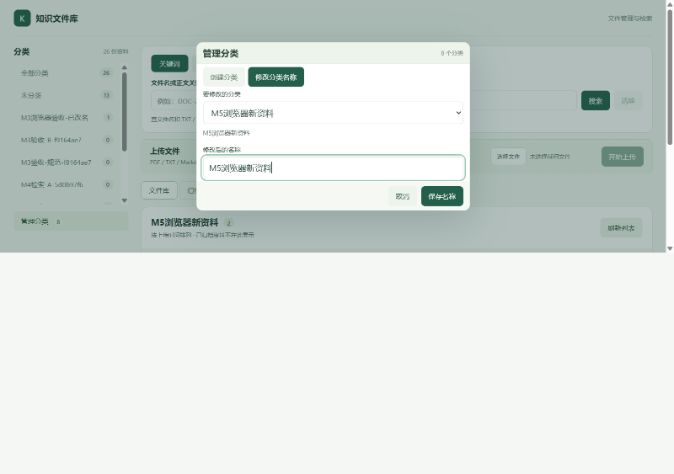
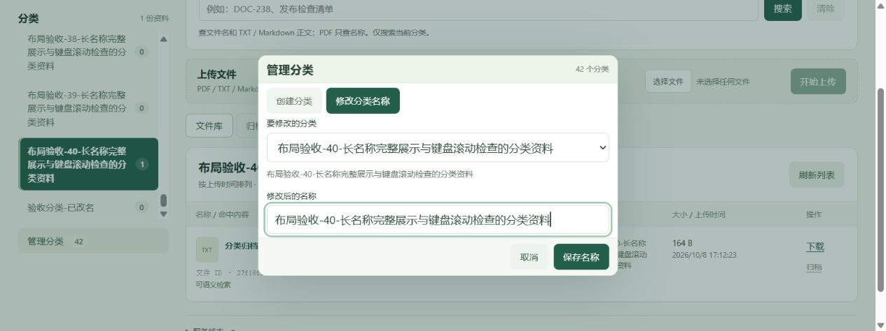

# 分类管理弹窗修复与验收

用户在普通 Chrome 人工验收中发现：侧栏展开改名后，输入框和保存按钮越过视口，滚动无法完成。此项人工验收判为不通过，保留原始记录；修复后普通Chrome批量整理已另行获用户确认，但该回复没有明确改名、低高度及390px专项，故本项仍待复验。

## 修改

侧栏只保留分类筛选、资料数量和“管理分类”按钮。分类列表独立纵向滚动，长名称换行并提供 title 提示，选中分类为深绿底、白字和左侧标记。聚焦列表时支持方向键、PageUp/PageDown、Home/End；Tab 可进入各筛选按钮。

创建和改名改为原生 HTML dialog。打开时按当前选中分类填入原名称，切换待修改分类也会重新填名。编辑区和保存/取消按钮不参与中间区域滚动，低窗口高度压缩留白；长说明单独滚动。重复名称保留草稿并显示错误，保存中禁止重复提交；Tab/Enter 可保存，Escape 可取消并返回“管理分类”。取消不写数据库。

后端、分类 ID、文件归属和存储格式未更改。演示服务重建前后，26 个文件、8 个分类的完整 API 元数据和全部 26 份下载 SHA-256 完全一致，见 `evidence/category-dialog/demo-before.json`、`demo-after.json`。42 分类的压力资料及新增分类只写入独立测试卷。

## 实际证据

| 执行类型 | 检查 | 实际结果 |
| --- | --- | --- |
| 编译 | npm run build：TypeScript + Vite 7.3.7 | 退出 0；最终前端命令约 6.45 秒，Vite 阶段 1.37 秒 |
| Docker | docker compose build；up -d --no-build --force-recreate --wait | 最终构建退出 0、90.809 秒；健康启动退出 0、12.613 秒。此前一次弹窗构建也退出 0；键盘滚动修正后重新构建，日志没有掩盖初次结果 |
| 独立 Docker 真实 HTTP | 创建→改名→移动→筛选→归档→恢复；两种搜索及下载 | 4 项检查通过、退出 0、内部 0.717 秒；`results.json` 与 `execution-summary.json` |
| Agent 内置浏览器 | 1280×480，42 分类，鼠标滚轮 | 列表 scrollTop 0→3154.4，页面 scrollY 保持 0；长名称完整换行，管理入口可见 |
| Agent 内置浏览器 | 分类列表键盘滚动 | 修正初次 End 键滚动页面的问题。最终 PageDown：分类 0→270.4，页面 scrollY 均为 13.6；Home/End 由列表自身处理 |
| Agent 内置浏览器 | 1280×480 改名、筛选、刷新 | 原名称自动填入；Tab 从输入到取消再到保存，Enter 保存；同一 ID 的分类、文件和新名称刷新后保留 |
| Agent 内置浏览器 | 390×480 鼠标和键盘改名、创建、重名失败 | 均实际操作。重名错误后输入/取消/保存仍可见，最下按钮 bottom=404.8<480；创建完成后分类数 42→43；切换分类会自动填入相应原名 |
| Agent 内置浏览器 | 390×300 长名称、Escape | 弹窗 top=12.2、bottom=287.8；输入 bottom=226.7、按钮 bottom=279，均在视口；中部 61px 可滚动，内容 105px；Escape 后焦点回到管理按钮，未改动取消的分类 |
| Agent 内置浏览器 | 390×480 改名→筛选→刷新 | 加载完成后标题“布局验收-40-键盘窄屏最终名称 1”、目标文件可见、分类 ID 保留；scrollWidth=clientWidth=375（另有15px纵向滚动条），没有横向溢出 |
| 独立 Docker 真实 HTTP | 浏览器改名后读取和过滤 | 43 分类，目标新名/ID/数量正确，取消的另一个分类原名保留；列表、关键词、语义在目标分类命中，在其他分类空；下载 SHA 为 `93ec7d84b08f99b7ade7ea43f1020a682dde81a8679de40a075bba1885ee165b`，与保存元数据及首次验收原字节一致；0.175 秒、退出 0 |
| Agent 内置浏览器，演示8000 | 新页面、选中原分类打开弹窗 | 已显示最终 `index-DdpbQ4_u.js`；“M5浏览器新资料”自动填名，1280×900、1280×480、390×480截图已保存；仅打开/取消，没有改名或增加演示数据 |
| 用户手动，普通 Chrome | 修复后同一窗口、低高度、390px | **待复验**。本次原生工具因无法可靠确认 Windows 当前浏览器 URL 自动停止，没有继续操作 Chrome；内置浏览器结果不能替代此项 |

`browser-records.json` 保存实际读到的布局数据和状态，包括刷新初始尚在加载的 0 条快照，以及等待文件按钮可操作后的 1 条结果。通过依据为加载完成的结果，不把请求未完成的快照当成持久化失败或通过。

执行：`python scripts/run_acceptance_docker.py --frontend-dir frontend/dist --port 18084 --keep-running` 创建独立容器/卷；`docker exec <本次容器> python scripts/prepare_category_layout.py` 增加40个长名称分类；浏览器操作完成后只读 HTTP 核对。准备脚本要求隔离标记、单个验收文件及最初2个分类，拒绝在普通演示服务运行。真实命令及响应日志见 `evidence/category-dialog/container-http.log`。测试容器完成后移除；测试卷保留，未清理演示卷。

## 截图

演示库低高度和窄屏，均为本次 Agent 内置浏览器截图：

独立42分类、长名称与更低视口：

## Chrome 简短复验

1. 当前 Chrome 打开8000并 Ctrl+Shift+R；选一个有文件的分类，点管理分类，确认自动填原名。改名保存，切换全部/该分类，刷新检查新名、文件和选中状态。
2. 降低窗口高度，将鼠标放在分类列表上滚动；再次打开弹窗，检查输入、保存、取消均可见。输入新名后按 Tab、Tab、Enter 保存；另开一次按 Escape 取消。
3. 约390px重复改名和刷新，检查无横向滚动；报告浏览器、宽高、通过项或具体失败点。仅据用户实际回复更新人工验收状态。
