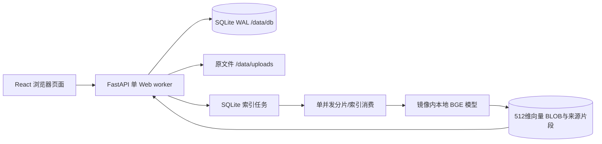

# 交付汇总与开发复盘

## 架构与实现范围

一个应用服务减少48小时部署与一致性复杂度。分类扁平，文件只有一个可空分类；没有目录树/标签/权限/版本。五张业务表为categories、documents、document_texts、index_jobs、chunks，另有独立M1诊断数据库。持久化命名卷挂载/data，模型只在构建时按固定revision下载，运行离线。Web worker固定1、目录进程锁和推理锁、单索引消费者均落实于代码/Dockerfile。

原文件提交与正文/向量状态分离：正文ready/向量failed仍可关键词和下载；接口分别返回textStatus/textError/vectorStatus/vectorError，详情提供重试。SQL任务和文件记录同提交，正式文件已落盘而数据库未提交时重启移入quarantine保留字节与意图。processing重启重领；文件ID+ordinal唯一、generation检查及事务原子替换，避免重复片段/旧任务覆盖。

关键词为规范化字面子串，名称和TXT/MD正文并查；语义使用本地模型真实归一化向量和NumPy点积精确检索，按文件最佳片段聚合，实时过滤当前分类/归档/ready任务代次。没有关键词兜底、指定文件命中或问答生成。

本人实现业务表与迁移、文件上传流/意图/完整性/崩溃对账、分类归档、正文编码/分片、任务发布/恢复/重试、关键词与向量检索、React交互、Docker及独立证据脚本。开源组件提供HTTP、UI、ORM、数学计算和预训练模型基础；未复制完整知识库项目。

| 组件来源 | 项目内用途 |
|---|---|
| [React](https://github.com/facebook/react)、[Vite](https://github.com/vitejs/vite)、[TypeScript](https://github.com/microsoft/TypeScript) | 页面状态/构建/类型检查 |
| [FastAPI](https://github.com/fastapi/fastapi)、[Uvicorn](https://github.com/encode/uvicorn)、[Starlette](https://github.com/encode/starlette) | HTTP、文件响应和multipart边界 |
| [SQLAlchemy](https://github.com/sqlalchemy/sqlalchemy)、[SQLite](https://sqlite.org/) | 表/事务/持久化 |
| [Sentence Transformers](https://github.com/huggingface/sentence-transformers)、[Transformers](https://github.com/huggingface/transformers)、[PyTorch](https://github.com/pytorch/pytorch)、[NumPy](https://github.com/numpy/numpy) | 本地加载/分词/CPU推理/点积 |
| [python-multipart](https://github.com/Kludex/python-multipart) | 成熟上传解析 |
| [BAAI/bge-small-zh-v1.5](https://huggingface.co/BAAI/bge-small-zh-v1.5) | 中文512维嵌入，固定7999e1d3359715c523056ef9478215996d62a620 |

依赖版本见requirements及前端lock，模型配置见model-spec.json。不存在仓库内密钥，.env通过环境变量配置且不提交。

## 五组统一资料实例

优化后真实新上传/容器HTTP测得排名1、1、2、1、1。问题、目标、实际分数和原文片段见retrieval-quality.md及evidence/retrieval/results.json（统一资料分类限制）。不是M1诊断向量复用。该表还记录5组同义改写、新上传设备/会议、3个无关问题、分类/归档及同名文件回归。

## 真实问题、修复与提交

| 真实问题/需求 | 处理与可查提交 |
|---|---|
| Docker管道/认证网络、PowerShell执行策略与stderr红字 | 保留失败日志，Docker代理后逐基础镜像拉取；不修改执行策略；M1 2e92b5d |
| Windows GBK管道遇到构建符号导致日志失败 | Python/子进程/文件UTF-8，M2 2f14cf5 |
| 分类归档需要持久化且恢复下载一致 | 实际HTTP/浏览器和原文件SHA，M3 e59f188 |
| 正文失败必须保留下载，关键词需要中文/完整编号 | 独立正文状态与字面命中片段，M4 462599d |
| 新业务上传需真实向量、失败/重启恢复 | 持久化任务、代次/片段唯一与故障实验，M5 35687a6 |
| 正文重试可能让正在生成的旧向量迟到发布 | 先事务增加generation再提取，失败/修复前后专项均保存，M6 7bcbc51 |
| 缺题目到证据映射、人工来源不清楚 | 独立P0链路与手动记录分离，53f3591 |
| 搜索/列表在首屏位置太低 | 分类侧栏/详情抽屉/窄屏卡片，60997a4 |
| 设备查询尾部出现发布资料 | 保留0.45，默认相对得分窗口及可展开候选，815a3b4 |
| 检索夹具混入P0设备文档使排名断言失败 | 分开空卷测试，不改目标/问题，失败报告保留，815a3b4 |
| 普通Chrome旧侧栏改名输入/保存越过视口 | 分类管理弹窗、独立列表滚动和低高度布局；60d5350，专项人工复验仍待确认 |
| 创建分类后需要选择多份文件加入 | 两入口批量整理、逐文件失败/重试和数量刷新；f7496a4，用户确认普通Chrome批量链路通过 |
| 旧runner连接演示库、缺独立源码冷构建证据 | 历史入口转入独立Compose项目，Git导出源码回归；PDF预览复用原文件校验，8bb301e |

以上来自实际代码、会话反馈和日志，不补造协作记录或人工动作时间。

Vite旧依赖在冷构建审计中实际发现高危项，升级精确7.3.7后npm审计0项，69944d3。随后从该提交导出源码的新空卷部署/重启/重建通过；冷构建与候选源码回归各自记录，未混淆缓存使用。当时的证据追加提交未改运行代码；后续分类弹窗及批量整理另有构建、独立空卷、真实HTTP和浏览器证据，见category-dialog-fix.md、batch-organization.md。

## 已知限制与交付状态

精确向量遍历适用于小资料集，未压测大型库；阈值和窗口不保证未知问题精度/召回，可展开更多。PDF正文/OCR不支持；预览阅读器兼容性仍需普通Chrome确认，下载作为替代。重复上传是独立ID，无文件去重/版本；索引不重复片段是另一件事。无登录/权限、问答或多服务。

用户已确认内置浏览器TXT/MD上传和设备来源、早期浏览器上传/详情/下载，以及普通Chrome批量分类的入口、多选移动、数量、刷新和两种搜索过滤。改名专项、低高度/390px、归档恢复完整链路和PDF预览仍待人工确认，见manual-check.md；最终回归/review及交付条件见remaining-acceptance.md。平台真实仓库与原始日志上传说明尚未提供，仓库无remote。当前提交仅候选，所有验证完成后再确定最终版本/锁定SHA/按真实说明上传日志；不提前填回执。
